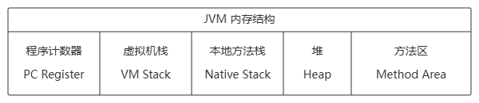
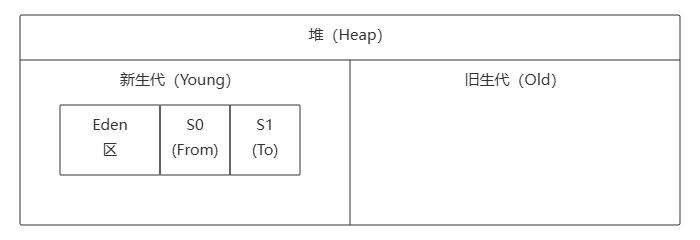
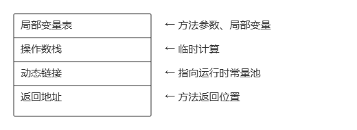
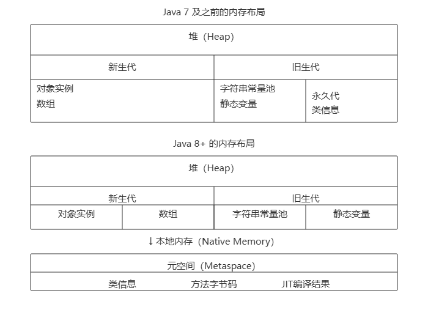
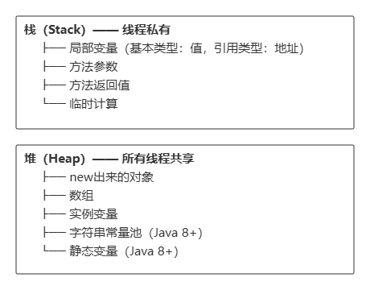
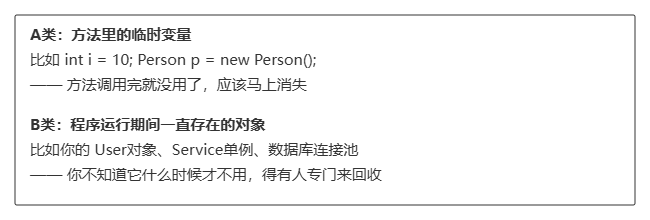
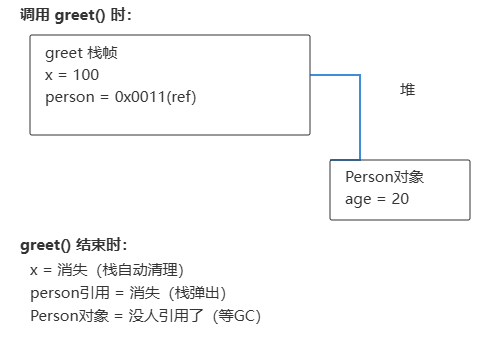
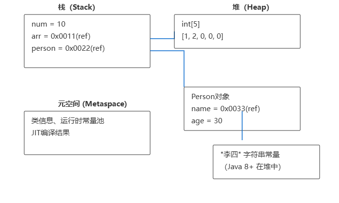

# Java内存模型详解：堆、栈、方法区一文搞懂

Java内存模型是Java虚拟机（JVM）在执行Java程序时管理的内存划分。理解它，你就能搞清楚对象存在哪、方法调用怎么运行、变量之间有啥区别。

## 一、整体架构

Java内存主要分为三大区域：**堆（Heap）**、**栈（Stack）**、**方法区（Method Area）**。此外还有**本地方法栈**和**程序计数器**。



## 二、堆（Heap）—— 对象的"大本营"

**堆是Java内存中最大的一块，被所有线程共享。**

### 1. 存放内容

- **所有new出来的对象**（比如 `new Object()`、`new int[10]`）
- **对象的实例变量**（成员变量）
- **数组**

### 2. 特点

| 特点   | 说明                 |
| ---- | ------------------ |
| 共享性  | 所有线程都能访问堆中的对象      |
| 容量大  | 通常占用内存最多           |
| 垃圾回收 | 堆是垃圾收集器（GC）管理的主要区域 |

### 3. 堆的内部划分：新生代、旧生代

**堆不只是一个大房间，它被分成了"新生代"和"旧生代"两个区域，这是为了更高效地回收垃圾。**

#### 为什么要分代？

现实中，大部分对象都是"朝生夕死"的——创建出来很快就不用了。只有少数对象会存活很久。

```
假设：
- 创建了 100 个对象
- 80 个用完就扔（死亡）
- 20 个长期存活

如果每次GC都扫描全部100个对象，太浪费！
所以把堆分成两块，区别对待，效率更高。
```

#### 堆的分区图解



| 区域                   | 作用         | 说明              |
| -------------------- | ---------- | --------------- |
| **Eden 区**           | 新对象诞生的地方   | 大部分对象在这里创建      |
| **Survivor S0/S1 区** | 存活对象的"中转站" | 经历GC还没死亡的对象来到这里 |
| **旧生代（Old区）**        | 长期存活的对象    | 多次GC还活着的"老油条"   |

#### 对象的一生

```
1. 新对象诞生
   ┌────────┐
   │ Eden区  │  ← 新对象创建在这里
   └────────┘

2. Eden区满了，触发 Minor GC
   - 死亡对象 → 直接回收
   - 存活对象 → 复制到 S0 区，清空 Eden

3. S0 满了，触发下一次 Minor GC
   - S0 和 Eden 中的存活对象 → 复制到 S1
   - S0 清空

4. S0 和 S1 来回切换（复制算法）
   - 每经历一次 GC，对象年龄 +1

5. 年龄达到阈值（默认15岁）→ 进入老年代
   ┌─────────────────────────────────┐
   │              旧生代              │  ← 老对象
   └─────────────────────────────────┘

6. 老年代满了 → 触发 Full GC（Stop The World，代价较大）
```

#### 举例

```java
public class GCdemo {
    public static void main(String[] args) {
        // 这些对象创建在 Eden 区
        for (int i = 0; i < 100; i++) {
            String s = new String("temp" + i); // 临时对象，用完就扔
        }

        // 这个对象可能存活很久，会进入老年代
        Person p = new Person();  // 长期存活对象
        p.name = "张三";
    }
}

class Person {
    String name;
    int age;
}
```

**在这个例子里：**

- 循环里的 `String` 对象，用完就扔，大部分在 Eden 区就被回收了
- `Person p` 这个引用栈中有，但 `new Person()` 对象如果长期被引用，会慢慢进入老年代

### 4. 运行时常量池 —— 存放"不变的值"

**运行时常量池是方法区（Java 8+ 是堆）的一部分，专门存放编译时就知道的"不变的值"。**

#### 常量池存放的内容

```java
public class Constants {
    // 1. 字符串字面量
    String s1 = "hello";       // "hello" 在常量池
    String s2 = "hello";       // 复用常量池中的 "hello"

    // 2. final 常量
    static final int MAX = 100; // MAX 在常量池

    // 3. 类信息中的符号引用
    //   - 类名、方法名、字段名
}
```

#### 字符串常量池的特殊性

```java
String s1 = "hello";      // 指向常量池中的 "hello"
String s2 = "hello";      // s1 和 s2 指向同一个对象！
String s3 = new String("hello"); // new 出来的是新对象，在堆中
```

```
常量池（Java 8+ 在堆中）：
┌─────────────┐
│ "hello"     │ ← s1 和 s2 都指向这里
└─────────────┘

堆中：
┌─────────────┐
│ new String  │ ← s3 指向这里（new出来的独立对象）
└─────────────┘
```

#### 为什么需要常量池？

**节省内存 + 提高效率**

```java
// 如果没有常量池
String s1 = new String("hello");
String s2 = new String("hello");
// 需要创建 2 个对象，内存浪费

// 有常量池
String s1 = "hello";
String s2 = "hello";
// 只创建 1 个对象，s1 和 s2 共享
```

#### 举例：常量池的工作方式

```java
public class PoolDemo {
    public static void main(String[] args) {
        String a = "java";        // 在常量池创建 "java"
        String b = "java";        // 复用常量池中的 "java"
        String c = new String("java"); // 在堆中创建新对象

        System.out.println(a == b);  // true，指向同一对象
        System.out.println(a == c);  // false，c 是 new 的新对象
        System.out.println(a.equals(c)); // true，内容相同
    }
}
```

| 比较            | 结果    | 原因                  |
| ------------- | ----- | ------------------- |
| `a == b`      | true  | a 和 b 指向常量池中同一个对象   |
| `a == c`      | false | c 是 new 出来的，在堆中是新对象 |
| `a.equals(c)` | true  | 内容相同，都是 "java"      |

**总结：**

- `==` 比较的是**引用地址**（是不是同一个对象）
- `equals` 比较的是**内容**（字符串一样不一样）

## 三、栈（Stack）—— 方法调用的"舞台"

**每个线程都有自己的栈，栈是线程私有的。**

### 1. 存放内容

- **方法调用的栈帧（Stack Frame）**
- **局部变量**（基本类型和对象引用）
- **方法参数**
- **返回值**
- **临时计算结果**

### 2. 栈帧结构

每次方法调用都会创建一个**栈帧**，包含：



### 3. 特点

| 特点   | 说明                              |
| ---- | ------------------------------- |
| 私有性  | 每个线程有独立的栈，互不干扰                  |
| 先进后出 | 就像叠盘子，最后放上去的最先被拿走               |
| 自动管理 | 方法结束，栈帧自动弹出，无需手动干预              |
| 容量有限 | 栈溢出（StackOverflowError）就是这个区域满了 |

### 4. 举例

```java
public class StackDemo {
    public static void main(String[] args) {
        int a = 10;           // 局部变量，在栈中
        int b = 20;
        int result = add(a, b); // 方法调用，add栈帧在栈中
        System.out.println(result);
    }

    public static int add(int x, int y) {  // x, y 参数在栈中
        int sum = x + y;    // sum 局部变量在栈中
        return sum;
    }
}
```

**内存流向：**

```
main() 栈帧
┌──────────────────┐
│ a = 10           │  ← 基本类型，值直接存栈中
│ b = 20           │
│ result = ?       │
│ add方法引用       │
└──────────────────┘
        ↓ 调用add()
add() 栈帧
┌──────────────────┐
│ x = 10           │  ← 从main栈帧复制过来
│ y = 20           │
│ sum = 30         │
└──────────────────┘
        ↓ 返回后
add() 栈帧弹出，result = 30
```

## 四、方法区（Method Area）—— 类的"档案室"

**方法区是被所有线程共享的内存区域。**

### 1. 存放内容

- **类的结构信息**（类的字段、方法、构造函数）
- **运行时常量池**（static常量和字符串常量）
- \*\* JIT编译器编译后的代码\*\*
- **静态变量**（在Java 8之后，静态变量移到堆中，但方法区仍存在）

### 2. 举例

```java
public class Student {
    static int count;           // 静态变量（Java 8+ 存在堆中）
    static final int MAX = 100; // 常量（在运行时常量池）
    String name;                // 实例变量，在堆中

    public static void study() { // 方法信息在方法区
        System.out.println("学习");
    }
}
```

### 3. Java 8+ 的重大变化：永久代 → 元空间

**高版本Java（Java 8+）在内存模型上有个核心变化——方法区的实现方式变了。**

| 版本         | 方法区实现              | 所在内存            |
| ---------- | ------------------ | --------------- |
| Java 7 及之前 | **永久代（PermGen）**   | 堆内存的一部分         |
| Java 8+    | **元空间（Metaspace）** | **本地内存**（不在堆里了） |



#### 具体存储位置对比

```java
String s1 = "hello";      // 字符串常量
static int count = 0;      // 静态变量
static final int MAX = 100; // 常量
```

| 数据类型         | Java 7 及之前 | Java 8+   |
| ------------ | ---------- | --------- |
| **字符串常量池**   | 永久代        | **堆**     |
| **静态变量**     | 永久代        | **堆**     |
| **类信息（元数据）** | 永久代        | 元空间（本地内存） |

#### 为什么要改？

**旧问题（永久代）：**

- 容易出现 `OutOfMemoryError: PermGen space`
- 大项目类多的时候，永久代大小难以调优
- 字符串常量池和类信息挤在一起

**新优势（元空间）：**

- 默认不再受堆大小限制，类加载器多的时候更"自由"
- 字符串常量池独立出来，管理更清晰
- 静态变量和对象在一起，GC一起回收

**注意：** 元空间虽然不在堆里，但受制于机器物理内存，可通过 `-XX:MaxMetaspaceSize` 限制。

#### 核心总结：堆和栈本身没变！



## 五、为什么要分堆和栈？

**Java之所以把内存分成堆和栈，是因为它们服务的目的完全不同。**

### 1. 本质原因：数据的"寿命"不一样

你的程序里有两类数据：



**如果只用一个区域会怎样？**

想象你只有一个大仓库（没有堆栈分类）：

- 临时变量和长期对象混在一起
- 垃圾回收器每次都要扫描"这个对象还在用吗"
- 程序慢得要死

### 2. 核心对比

| 对比       | 栈（Stack）         | 堆（Heap）           |
| -------- | ---------------- | ----------------- |
| **存什么**  | 方法参数、局部变量、返回值    | 对象、数组             |
| **生命周期** | 方法调用时创建，方法结束自动消失 | 对象创建时诞生，GC判断不用才消失 |
| **谁来管**  | JVM自动管理（进栈/出栈）   | 垃圾回收器（GC）         |
| **线程**   | 线程私有，每个线程有自己的栈   | 所有线程共享            |
| **速度**   | 快（连续内存，LIFO）     | 慢（随机访问，需要追踪引用）    |
| **空间**   | 小（默认1MB）         | 大（可达数GB）          |

### 3. 一个生活类比

```
栈      →  餐巾纸
         用完就扔（方法结束自动释放），不需要保洁阿姨

堆      →  餐桌上的盘子
         用完了不能直接扔，得等保洁阿姨来判断（GC）确认不用了才收走
```

### 4. 代码实例：生命周期演示

```java
public class LifeDemo {
    public static void main(String[] args) {
        int a = 10;              // 栈：main方法结束后 a 就没了
        String name = "张三";     // 栈：name引用 | 堆：实际字符串

        Person p = new Person(); // 栈：p引用 | 堆：Person对象
        p.age = 20;

        greet(p);                // 栈：greet的栈帧
    }

    public static void greet(Person person) {
        int x = 100;              // 栈：greet方法结束就没了
        System.out.println(person.age);
    }   // ← greet方法结束，x 和 person引用全部弹出栈
}   // ← main方法结束，a、name、p 全部弹出栈
  // ← Person对象没人引用了，等GC来回收
```

**内存变化过程：**



### 5. 一句话总结

> **栈管"用完就走"的数据（方法调用），堆管"长期存在"的数据（对象）。**
>
> 分开管理，栈这边自动释放不用操心，堆那边集中精力对付"什么时候回收"的问题。

这样设计是为了让Java程序既**快**（栈）又**省心**（自动回收），如果你全放堆里，那每个变量都得靠GC来判断什么时候不要了，程序会慢很多。

## 六、核心区别对比

| 对比维度     | 堆（Heap）          | 栈（Stack）           |
| -------- | ---------------- | ------------------ |
| **存储内容** | 对象、数组、实例变量       | 方法调用、局部变量、方法参数     |
| **线程共享** | 所有线程共享           | 线程私有               |
| **大小**   | 较大（可达数GB）        | 较小（默认1MB左右）        |
| **回收方式** | 垃圾回收器自动回收        | 方法结束自动释放           |
| **异常**   | OutOfMemoryError | StackOverflowError |
| **存储方式** | 对象实例存在堆中         | 存储的是值或引用地址         |

## 七、常见误区澄清

### 1. 引用存在哪？

```java
Person p = new Person();
```

- `p` 是局部变量，存在**栈**中
- `new Person()` 对象，存在**堆**中
- `p` 存储的是对象的**地址引用**

### 2. 基本类型 vs 引用类型

```java
int age = 25;          // 基本类型，值直接存在栈中
Person p = new Person(); // 引用类型，p在栈中指向堆中的对象
```

### 3. 字符串的特殊性

```java
String s1 = "hello";      // 字符串常量，Java 8+ 存在堆中（字符串常量池）
String s2 = new String("hello"); // new创建的对象在堆中
```

**注意：** Java 8+ 字符串常量池在堆中，而 Java 7 及之前在永久代（堆的一部分）。

## 八、一图理解内存分配

```java
public class MemoryLayout {
    public static void main(String[] args) {
        int num = 10;              // 栈：num = 10
        int[] arr = new int[5];    // 栈：arr引用 | 堆：int[5]数组
        arr[0] = 1;
        arr[1] = 2;

        Person person = new Person(); // 栈：person引用 | 堆：Person对象
        person.name = "李四";
        person.age = 30;
    }
}

class Person {
    String name;  // 堆：name引用指向字符串常量池
    int age;       // 堆：age值
}
```



**注：** Java 8+ 中，字符串常量池移到了堆中，类信息移到了元空间（本地内存）。

## 九、实际开发中的注意事项

### 1. 栈溢出（StackOverflowError）

```java
// 递归没有终止条件，会导致栈溢出
public static void recursive() {
    recursive(); // 栈帧不断创建，直到栈满
}
```

### 2. 堆溢出（OutOfMemoryError）

```java
// 不断创建大对象，不进行垃圾回收
ArrayList<byte[]> list = new ArrayList<>();
while (true) {
    list.add(new byte[1024 * 1024]); // 不断向堆中添加大对象
}
```

### 3. 性能优化建议

- **局部变量优先**：尽量使用局部变量，避免创建不必要的对象
- **减少大对象创建**：大对象直接进入老年代，频繁创建会造成GC压力
- **注意内存泄漏**：不再使用的对象应及时断开引用

## 十、总结

| 区域          | 核心作用          | 数据类型                                     |
| ----------- | ------------- | ---------------------------------------- |
| **堆**       | 存储对象和数组       | 所有new出来的对象、静态变量（Java 8+）、字符串常量池（Java 8+） |
| **栈**       | 支持方法调用，存储局部变量 | 基本类型值、对象引用                               |
| **方法区/元空间** | 存储类信息和常量      | 类结构（Java 8+移至元空间）、JIT编译结果                |

**记住一个核心原则：**

> **"堆放对象，栈放变量"**
>
> - 对象本身在堆中
> - 变量（局部变量、引用）存在栈中
> - 变量指向堆中的对象

***

学Java内存模型，关键是多画图、多实践。理解了这个，你在学习多线程、垃圾回收、性能优化时都会事半功倍！
