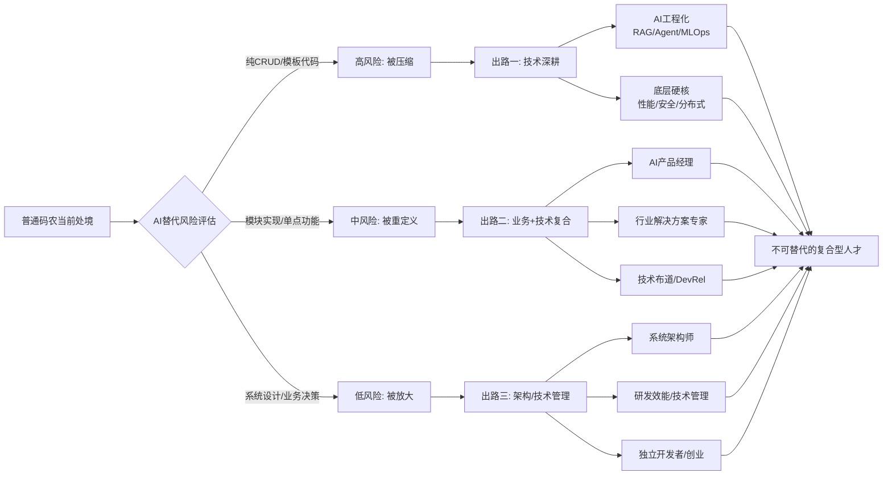

AI替代的是"纯编码执行者"，而不是"理解业务+系统设计+决策的人"。Gartner预测到2026年将有30%的代码由AI生成，传统"代码搬运工"岗位需求大幅下滑，但MLOps工程师、AI系统架构师等高阶岗位需求却在逆势增长——结构性出清正在发生，出清的是可被标准化的编码工作，留下的是能驾驭AI去创造价值的人【turn0search1】【turn1search0】。

先看懂这张趋势图，再决定往哪个方向走：

## 三大转型路径对比

| 转型方向 | 核心能力要求 | 难度 | 适合人群 | 行动起点 |
|---------|------------|------|---------|---------|
| **技术深耕型**（AI工程化/底层硬核） | 系统设计+AI协同+工程化 | 高 | 有扎实基础、愿意持续钻研 | 学LangChain/RAG/Agent，做1个完整AI应用 |
| **业务+技术复合型**（AI PM/行业方案） | 业务洞察+技术理解+沟通 | 中 | 善沟通、对业务有兴趣 | 选1个垂直行业深挖，积累AI落地案例 |
| **架构/管理型**（系统架构师/技术管理） | 全局视野+决策力+团队赋能 | 高 | 8年+经验、有架构思维 | 主导复杂系统设计，做团队AI赋能者 |

数据来源整合自多家行业分析【turn0search0】【turn0search2】【turn1search3】。

## AI无法替代的三类能力

**第一类：复杂系统设计与架构决策。** AI能生成函数级代码，但无法回答"这个系统该怎么拆分微服务""高并发支付接口如何支撑1000QPS"这类需要全局权衡的问题。资深程序员的核心价值，在于用最少的token精准描述任务边界，避免AI因上下文过载而失效【turn1search21】。

**第二类：业务领域知识与模糊需求拆解。** AI能写代码，但无法理解老板说"做个淘宝"背后真实的含义是"三天上线二手交易平台"；能修BUG，但处理不了"按钮颜色随领导心情变化"这类混沌需求【turn0search4】。金融科技要懂头寸管理，医疗信息化要懂DRG分组——这些领域知识构成了不可复制的竞争壁垒【turn0search4】【turn1search0】。

**第三类：代码审查与质量把关。** 当80%的代码由AI生成时，剩下20%的时间变成"80%时间审查代码"：发现边界漏洞、防范提示词注入攻击、预判AI的"战术编程"陷阱。Anthropic的代码审核系统已实现单次扫描3000行/秒，但这反而放大了人类审查在架构合理性、业务契合度上的判断价值【turn1search21】【turn1search24】。

## 三条转型路径的具体行动建议

### 路径一：技术深耕——AI工程化是最平滑的升级

这是转型成本最低、薪资溢价最高的方向。你不需要去卷大模型算法训练（门槛极高），而是聚焦**AI应用落地**：RAG系统、Agent搭建、企业AI流程赋能、私有化部署、AI工具二次开发【turn0search5】【turn0search7】。

具体技能树：Python + LangChain/LlamaIndex + 向量数据库（Pinecone/Weaviate）+ Prompt工程；MLOps侧掌握Docker/K8s + MLflow + 云AI服务（AWS Bedrock/阿里云PAI）；Agent侧学工具调用、LangGraph/AutoGen工作流编排【turn0search2】。3-5年经验者年薪可达40-80万。

**行动起点**：用Cursor或Claude Code从0到1做一个完整AI应用（如企业知识库问答、自动化工作流），把它放进简历。工具选择上，Cursor适合AI-first的快速原型开发，Copilot胜在企业合规和GitHub生态集成【turn0search25】。

### 路径二：业务+技术复合——AI产品经理是黄金赛道

AI产品经理招聘涨幅达144%，核心岗位薪资35-50万/年，从程序员转型者平均涨薪40%【turn1search13】【turn1search15】。程序员转AI PM是"加法转型"——不丢技术，而是让技术创造更大商业价值，三大优势是懂技术语言、逻辑严密、执行力强【turn1search17】。

能力模型可概括为：**AI PM = 技术理解力 × 产品思维 × 商业落地力**。要补的短板是用户洞察、需求定义、跨部门协作【turn1search17】。

**行动起点**（6个月路径）：
- 第1-2个月：建立AI认知，学模型/参数/训练/推理/Prompt基础，用OpenAI、通义千问API做小实验
- 第3-4个月：训练产品思维，拆解Notion AI、Kimi等案例，练习写AI PRD
- 第5-6个月：做1-2个真实AI项目（哪怕是自己搭的Demo），积累落地经验【turn1search17】

切入策略上，从最小业务场景入手，先跑通闭环、算清ROI，再逐步扩展——TCL的实践是先在十几人的代码评审场景试点，再延伸至测试、知识沉淀【turn1search19】。

### 路径三：架构/技术管理——把经验变成"放大器"

8年+的资深程序员是AI时代的受益者。AI拉平了不同级别程序员在"打字速度"上的差距，却无限放大了他们在"系统认知"和"工程智慧"上的鸿沟【turn1search23】。

价值体现在三处：一是精准规划系统架构，用最少token描述任务边界；二是质量把关，从"生成代码"转向"守护系统"；三是经验释放，把繁琐的Getter/Setter、接口实现、数据迁移脚本交给AI，把精力投入系统设计、跨团队协调、性能瓶颈分析【turn1search21】【turn1search23】。

**行动起点**：把自己当"技术产品经理"，定义问题、设计方案、验收结果，具体实现交给AI和年轻人；主动成为团队AI应用的推动者，建立AI生成代码的审查规范【turn1search5】【turn1search29】。

## 分阶段差异化策略

不同工龄的人，处境和打法完全不同：

**0-3年初级程序员**（最危险也最有机会）：替代率高达85%，但学习能力强、没有思维定式。关键不是和AI比"写代码速度"，而是比"理解问题深度"——前3年打基础，学数据结构、算法、操作系统、网络原理，不要过早依赖AI；把AI当老师而非枪手，找到愿意教你的mentor快速成长【turn1search3】【turn1search5】【turn1search9】。

**3-8年中级程序员**（转型关键期）：处于"可上可下"的分水岭，向上深耕成专家，向下被AI压成代码审核员。这个阶段最忌"什么都懂一点，什么都不精"——必须选一个方向扎下去：要么技术深度（性能优化、安全防护、分布式系统等AI难以掌握的领域），要么业务深度（深耕一个垂直行业），要么管理能力（主导小型项目架构，锻炼系统设计）【turn1search5】【turn1search9】。

**8年+资深程序员**（AI时代的受益者）：用AI放大价值而非保护手艺。把重复工作交给AI，专注高价值任务；帮助团队适应AI，成为变革推动者。你积累的经验、判断力、人脉，是AI短期无法替代的——关键在于愿不愿意放下"亲手写代码"的执念【turn1search5】【turn1search23】。

## 一句话收束

1995年有人说可视化编程会让程序员失业，2005年有人说开源框架会，2015年有人说低代码会——AI时代淘汰的从来不是程序员这个职业，而是"不进化的程序员"。出路不在于转行逃离，而在于把身份从"写代码的人"重定义为"用代码（和AI）解决问题的人"：会提问、懂业务、能决策、敢负责，这四件事AI做不了，这就是普通码农的护城河。