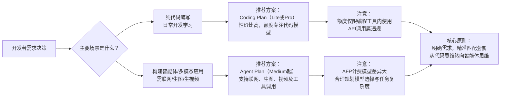

# 火山方舟产品线演进：从 Coding Plan 到 Agent Plan 的战略跃迁

> 火山方舟的个人订阅服务正在发生显著变化。随着 Agent Plan 的正式上线，资源与运营重心明显向全模态智能体场景倾斜。这并非简单的套餐更替，而是平台对 AI 生产力形态演进做出的积极响应——从辅助编码的“工具箱”，迈向构建自主执行任务的“数字员工”平台。

## 一、 什么是火山方舟 Agent Plan？

Agent Plan 是火山方舟推出的面向个人用户的**订阅式大模型服务套餐包**，其核心定位是**主打 Agent 场景，支持全模态模型及专属 Harness（工具链）**【turn0search11】。

与仅支持文本和向量化模型的 Coding Plan 不同，Agent Plan 的核心升级在于：
*   **模型范围扩展**：新增了图像生成（Doubao-Seedream）、视频生成（Doubao-Seedance）等视觉模型【turn0search11】。
*   **Harness 工具集成**：首次内置了联网搜索（Beta版）能力，并集成了用于增强记忆的 Embedding 模型，为 Agent 提供实时信息获取和长程记忆能力【turn0search0】【turn0search4】。
*   **生态兼容**：无缝接入 OpenClaw、Hermes Agent、Claude Code、OpenCode 等主流编程及 Agent 工具【turn0search0】。

简言之，**Coding Plan 是“AI编程助手”，而 Agent Plan 是“AI员工构建平台”**。前者专注于写代码，后者则能联网搜索、生成多媒体内容、规划并执行复杂任务。

## 二、 Agent Plan 如何计费？AFP 积分制详解

Agent Plan 采用了全新的 **Agent 燃料值（AFP）** 作为统一计费单位，这是一种精细化的积分模式，不同模型和工具的消耗差异巨大【turn0search0】。

### 1. 套餐与价格
Agent Plan 提供四档套餐，均设有多级额度限制【turn0search0】：

| 套餐 | 月费 | 月额度(AFP) | 周额度(AFP) | 5小时额度(AFP) | 视觉模型日额度(AFP) |
| :--- | :--- | :--- | :--- | :--- | :--- |
| Small | 40元 | 20,000 | 7,000 | 2,000 | 10,000 |
| Medium | 200元 | 100,000 | 35,000 | 10,000 | 50,000 |
| Large | 500元 | 250,000 | 87,500 | 25,000 | 125,000 |
| Max | 1000元 | 500,000 | 175,000 | 50,000 | 250,000 |

**联网搜索**：Medium及以上套餐赠送免费额度（50-800次/月），本期不消耗AFP【turn0search0】。

### 2. AFP 抵扣机制
AFP 的消耗取决于模型类别和输入长度，计算公式如下：
*   **文本/向量化/视频生成模型**：`消耗AFP = (消耗的原始Tokens / 10,000) × 抵扣系数`
*   **图片生成模型**：`消耗AFP = 成功生成的图片张数 × 抵扣系数`【turn0search0】

**关键抵扣系数表**【turn0search0】：

| 模型类别 | 代表模型 | 抵扣系数 | 备注 |
| :--- | :--- | :--- | :--- |
| 极速模型 | doubao-seed-2.0-mini | 0.5 × 分段系数 | |
| 标准模型 | doubao-seed-2.0-lite | 1 × 分段系数 | |
| 进阶模型 | doubao-seed-2.0-pro, deepseek-v3.2 | 5 × 分段系数 | |
| **第三方模型** | **glm-5.1, kimi-k2.6** | **9 × 分段系数** | **消耗最快** |
| 视频生成 | doubao-seedance-2.0 | 140/230 | 按输入是否含视频区分 |
| 图片生成 | doubao-seedream-5.0-lite | 99 AFP/张 | |

**分段系数**（由输入长度决定）【turn0search0】：
*   0-32k Tokens：0.67
*   32k-128k Tokens：1
*   128k+ Tokens：2

**示例**：使用 `doubao-seed-2.0-code`（系数5），输入50k，输出0.5k token。则 AFP 消耗 = `(50000+500)/10000 * 5 * 1 = 25.25 AFP`【turn0search0】。

> 💡 **重要提示**：套餐额度**仅在AI编程/Agent工具中生效，不可用于API调用**。违规使用可能导致订阅停用【turn0search0】。

## 三、 Agent Plan 能用来干嘛？

Agent Plan 的能力远超代码生成，核心场景包括：

1.  **多模态内容生成**：一键生成图片（doubao-seedream）、视频（doubao-seedance），适用于快速制作营销素材、短视频等【turn0search0】。
2.  **联网信息获取**：内置联网搜索功能，让 Agent 能获取实时信息，完成市场调研、新闻汇总等任务【turn0search0】。
3.  **构建自动化工作流**：结合 Hermes Agent、OpenClaw 等工具，构建能自主规划、调用工具、执行复杂流程的“数字员工”，例如自动调研竞品并生成报告【turn0search27】。
4.  **增强记忆与上下文理解**：内置的 Embedding 模型帮助 Agent 在长对话和分散资料中更准确地召回信息，提升多轮任务效果【turn0search4】。

## 四、 Agent Plan vs Coding Plan：核心对比

| 维度 | Coding Plan | Agent Plan |
| :--- | :--- | :--- |
| **核心定位** | 主打 Coding 场景【turn0search11】 | 主打 Agent 场景，向多模态及 Harness 发展【turn0search11】 |
| **模型范围** | 语言模型、向量化模型【turn0search11】 | 语言、向量化、**视觉模型（生图/生视频）**【turn0search11】 |
| **Harness** | / | **联网搜索**【turn0search11】 |
| **计费方式** | 预估模型调用次数【turn0search11】 | **AFP积分制**【turn0search0】 |
| **套餐档位** | 2档 (Lite/Pro) | **4档** (Small/Medium/Large/Max)【turn0search0】 |
| **适用场景** | 纯代码编写、调试 | 需要联网、生图生视频、构建复杂Agent的场景 |

**模型支持**：两者文本模型基本一致，Agent Plan 额外多出生图、生视频及联网搜索能力【turn0search6】。

## 五、 对开发人员的影响

1.  **成本结构更复杂，需精打细算**：AFP 机制下，使用高系数模型（如GLM-5.1、Kimi-K2.6）或长上下文会快速消耗额度。开发者必须根据任务选择模型，优化成本【turn0search0】。
2.  **技能需求升级**：从“提示词工程”转向“智能体工程”，需掌握任务拆解、工具调用、工作流设计等新技能【turn0search27】。
3.  **开发范式转变**：开发者角色从“写代码的人”变为“管理数字员工的人”，需要更强的系统设计和流程管理能力。

## 六、 为什么进行此次产品线调整？（行业分析）

此次调整并非孤立事件，需置于行业背景下理解：

1.  **“低价包月”模式不可持续**：行业普遍存在“固定月费 vs 无限使用”的矛盾。重度用户算力消耗远超订阅费，导致厂商亏损。阿里云、腾讯云等已停售低价 Coding Plan 或转向更贵的 Token Plan，即是明证【turn0search35】【turn0search37】。**（此为基于行业趋势的商业逻辑分析）**
2.  **Agent 是更高价值场景**：单纯代码生成已趋同质化，而能解决复杂业务流程的 Agent 才是真正的生产力，具有更高付费意愿和商业价值。Agent Plan 通过打包模型与工具，提供了更完整的解决方案【turn0search45】。
3.  **精细化运营与成本管控**：AFP 积分制和复杂的抵扣系数，本质上是将算力成本更精确地与用户使用行为挂钩，避免算力被低价值任务挤占，实现资源更优配置【turn0search0】。

## 七、 使用者的应对方案

1.  **明确需求，按需选择**：
    *   如果只用 Claude Code、Cursor 写代码，**Coding Plan 更划算**，额度全部用于文本模型【turn0search6】。
    *   如果需要跑 Agent、联网搜索或生成多模态内容，**必须选 Agent Plan**。Small 档可尝鲜，Medium 及以上才能获得完整体验和充足 AFP【turn0search0】【turn0search6】。

2.  **精通 AFP 计费，优化成本**：
    *   日常简单任务优先用极速或标准模型，将高系数模型留给复杂问题。
    *   注意输入长度，长上下文任务 AFP 消耗倍增。
    *   充分利用联网搜索的免费额度。

3.  **升级思维，拥抱智能体工程**：
    *   学习如何为 Agent 设计任务、分配工具、构建工作流。
    *   实践多模态Agent应用，如“截图→代码”、“需求→视频”的自动化流程。

## 八、 我的看法：从“卖工具”到“卖生产力”

Agent Plan 的推出，清晰标志着大模型竞争从“模型参数竞赛”进入“生态与落地”的新阶段【turn0search45】。

1.  **AI 角色的质变**：从“辅助工具”进化为“生产力单元”。Agent Plan 旨在构建能接受目标、自主规划、调用工具并交付结果的“数字员工”，这是从 Copilot 到 Agent 的根本性跨越。
2.  **商业模式的演进**：行业已证明，单纯卖模型调用的“水电煤”模式难以为继。将模型、工具、算力打包成“生产力解决方案”按价值付费，是更可持续的路径。AFP 机制正是这一思路的体现。
3.  **开发者的新挑战与机遇**：最大的挑战在于思维转换——从“用AI写代码”到“用AI解决问题”。未来的核心竞争力，将属于那些能设计出高效、可靠智能体工作流的“智能体工程师”。

**结论**：Agent Plan 是火山方舟在 AI 商业化路径上的重要一步。它正确判断了行业风向，将赌注押在“智能体”这一更高形态上。对于开发者而言，这既是成本核算方式的新挑战，更是拥抱下一代AI生产力、构建竞争壁垒的新机遇。